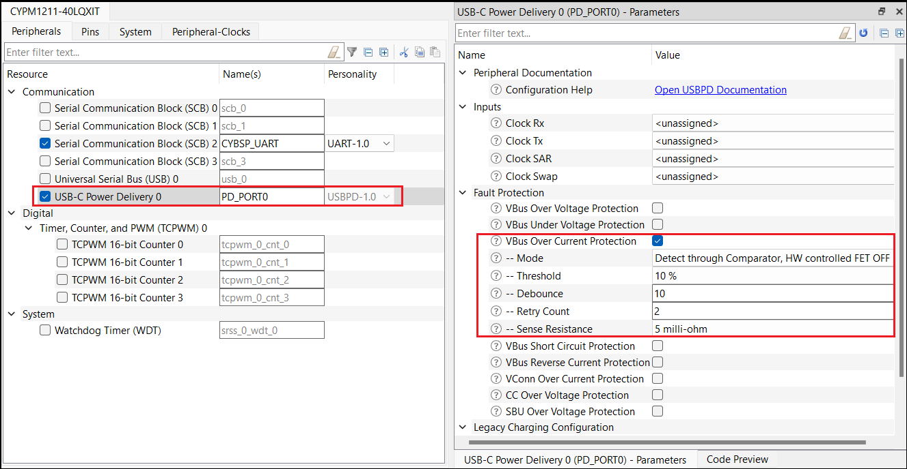

# EZ-PD&trade; PMG1 MCU: Using the CSA block for OCP, SCP, and RCP

This example demonstrates the use of overcurrent protection (OCP), short-circuit protection (SCP), and reverse current protection (RCP) features of current sense amplifier (CSA) block from USB PD peripheral on the Type-C VBUS pin of EZ-PD&trade; PMG1 MCUs. The CSA block is used as a standalone block in this example.

[View this README on GitHub.](https://github.com/Infineon/mtb-example-pmg1-ocp-scp-rcp)

[Provide feedback on this code example.](https://cypress.co1.qualtrics.com/jfe/form/SV_1NTns53sK2yiljn?Q_EED=eyJVbmlxdWUgRG9jIElkIjoiQ0UyMzkxMTMiLCJTcGVjIE51bWJlciI6IjAwMi0zOTExMyIsIkRvYyBUaXRsZSI6IkVaLVBEJnRyYWRlOyBQTUcxIE1DVTogVXNpbmcgdGhlIENTQSBibG9jayBmb3IgT0NQLCBTQ1AsIGFuZCBSQ1AiLCJyaWQiOiJhbmtpdCB0cmlwYXRoaSIsIkRvYyB2ZXJzaW9uIjoiMS4wLjAiLCJEb2MgTGFuZ3VhZ2UiOiJFbmdsaXNoIiwiRG9jIERpdmlzaW9uIjoiTUNEIiwiRG9jIEJVIjoiV0lSRUQiLCJEb2MgRmFtaWx5IjoiVFlQRS1DIn0=)

## Requirements

- [ModusToolbox&trade;](https://www.infineon.com/modustoolbox) v3.1 or later (tested with v3.1)
- Board support package (BSP) minimum required version: 3.1.0
- Programming language: C
- Associated parts: [EZ-PD&trade; PMG1-S1 MCU](https://www.infineon.com/PMG1), [EZ-PD&trade; PMG1-S2 MCU](https://www.infineon.com/PMG1), and [EZ-PD&trade; PMG1-S3 MCU](https://www.infineon.com/PMG1)

## Supported toolchains (make variable 'TOOLCHAIN')

- GNU Arm&reg; Embedded Compiler v10.3.1 (`GCC_ARM`) – Default value of `TOOLCHAIN`
- Arm&reg; Compiler v6.16 (`ARM`)
- IAR C/C++ Compiler v9.30.1 (`IAR`)

## Supported kits (make variable 'TARGET')

-  [EZ-PD&trade; PMG1-S1 Prototyping Kit](https://www.infineon.com/CY7111) (`PMG1-CY7111`) – Default value of `TARGET`
-  [EZ-PD&trade; PMG1-S2 Prototyping Kit](https://www.infineon.com/CY7112) (`PMG1-CY7112`)
-  [EZ-PD&trade; PMG1-S3 Prototyping Kit](https://www.infineon.com/CY7113) (`PMG1-CY7113`)

## Hardware setup

This example uses the board's default configuration. See the kit user guide to ensure that the board is configured correctly.

1. Connect the VBUS_TYPE-C pin to CSP MCU pin.

2. Connect a Rsense resistor of 5 milli-ohm between CSP and CSN MCU pins.

**Figure 1. Hardware connection**


3. Connect the UART Tx and UART Rx lines from the PMG1 kit to J3.8 and J3.10 on KitProg3 respectively to establish a UART connection between KitProg3 and the EZ-PD&trade; PMG1 device for the following revisions of the EZ-PD&trade; PMG1 prototyping kits.

**Table 1. EZ-PD&trade; PMG1 kit UART connection**

 EZ-PD&trade; PMG1 prototyping kit              | UART Tx       | UART Rx       
 :-------------------------------  | :-------------| :-------------
 PMG1-CY7111 (revision 2 or lower) | J6.10 to J3.8 | J6.9 to J3.10 
 PMG1-CY7112 (revision 2 or lower) | J6.10 to J3.8 | J6.9 to J3.10 
 PMG1-CY7113 (revision 3 or lower) | J6.10 to J3.8 | J6.9 to J3.10 

> **Note:** All EZ-PD&trade; PMG1 prototyping kits with a higher revision have UART lines internally connected. Therefore, external wiring is not required. If UART `DEBUG_PRINT` messages are enabled, UART connection is needed. See [Compile-time configurations](#compile-time-configurations) for more details.

## Software setup

Install a terminal emulator if you don't have one. Instructions in this document use [Tera Term](https://teratermproject.github.io/index-en.html).

This example requires no additional software or tools.

> **Note:** If the `DEBUG_PRINT` macro is enabled, Tera Term is needed to view UART print messages.

## Using the code example

The ModusToolbox&trade; tools package provides the Project Creator as both a GUI tool and a command line tool.

<details><summary><b>Use Project Creator GUI</b></summary>

1. Open the Project Creator GUI tool.

   There are several ways to do this, including launching it from the dashboard or from inside the Eclipse IDE. For more details, see the [Project Creator user guide](https://www.infineon.com/ModusToolboxProjectCreator) (locally available at *{ModusToolbox&trade; install directory}/tools_{version}/project-creator/docs/project-creator.pdf*).

2. On the **Choose Board Support Package (BSP)** page, select a kit supported by this code example. See [Supported kits](#supported-kits-make-variable-target).

   > **Note:** To use this code example for a kit not listed here, you may need to update the source files. If the kit does not have the required resources, the application may not work.

3. On the **Select Application** page:

   a. Select the **Applications(s) Root Path** and the **Target IDE**.

   > **Note:** Depending on how you open the Project Creator tool, these fields may be pre-selected for you.

   b.	Select this code example from the list by enabling its check box.

   > **Note:** You can narrow the list of displayed examples by typing in the filter box.

   c. (Optional) Change the suggested **New Application Name** and **New BSP Name**.

   d. Click **Create** to complete the application creation process.

</details>

<details><summary><b>Use Project Creator CLI</b></summary>

The 'project-creator-cli' tool can be used to create applications from a CLI terminal or from within batch files or shell scripts. This tool is available in the *{ModusToolbox&trade; install directory}/tools_{version}/project-creator/* directory.

Use a CLI terminal to invoke the 'project-creator-cli' tool. On Windows, use the command-line 'modus-shell' program provided in the ModusToolbox&trade; installation instead of a standard Windows command-line application. This shell provides access to all ModusToolbox&trade; tools. You can access it by typing "modus-shell" in the search box in the Windows menu. In Linux and macOS, you can use any terminal application.

The following example clones the "[Using CSA block for OCP, SCP, and RCP](https://github.com/Infineon/mtb-example-pmg1-ocp-scp-rcp)" application with the desired name "MyCsaBlockForOcpScpRcp" configured for the *PMG1-CY7111* BSP into the specified working directory, *C:/mtb_projects*:

   ```
 project-creator-cli --board-id PMG1-CY7111 --app-id mtb-example-pmg1-usbpd-ocp-scp-rcp --user-app-name MyCsaBlockForOcpScpRcp --target-dir "C:/mtb_projects"
   ```

The 'project-creator-cli' tool has the following arguments:

Argument | Description | Required/optional
---------|-------------|-----------
`--board-id` | Defined in the <id> field of the [BSP](https://github.com/Infineon?q=bsp-manifest&type=&language=&sort=) manifest | Required
`--app-id`   | Defined in the <id> field of the [CE](https://github.com/Infineon?q=ce-manifest&type=&language=&sort=) manifest | Required
`--target-dir`| Specify the directory in which the application is to be created if you prefer not to use the default current working directory | Optional
`--user-app-name`| Specify the name of the application if you prefer to have a name other than the example's default name | Optional

> **Note:** The project-creator-cli tool uses the `git clone` and `make getlibs` commands to fetch the repository and import the required libraries. For details, see the "Project creator tools" section of the [ModusToolbox&trade; tools package user guide](https://www.infineon.com/ModusToolboxUserGuide) (locally available at {ModusToolbox&trade; install directory}/docs_{version}/mtb_user_guide.pdf).

</details>


### Open the project

After the project has been created, you can open it in your preferred development environment.


<details><summary><b>Eclipse IDE</b></summary>

If you opened the Project Creator tool from the included Eclipse IDE, the project will open in Eclipse automatically.

For more details, see the [Eclipse IDE for ModusToolbox&trade; user guide](https://www.infineon.com/MTBEclipseIDEUserGuide) (locally available at *{ModusToolbox&trade; install directory}/docs_{version}/mt_ide_user_guide.pdf*).

</details>


<details><summary><b>Visual Studio (VS) Code</b></summary>

Launch VS Code manually, and then open the generated *{project-name}.code-workspace* file located in the project directory.

For more details, see the [Visual Studio Code for ModusToolbox&trade; user guide](https://www.infineon.com/MTBVSCodeUserGuide) (locally available at *{ModusToolbox&trade; install directory}/docs_{version}/mt_vscode_user_guide.pdf*).

</details>


<details><summary><b>Keil µVision</b></summary>

Double-click the generated *{project-name}.cprj* file to launch the Keil µVision IDE.

For more details, see the [Keil µVision for ModusToolbox&trade; user guide](https://www.infineon.com/MTBuVisionUserGuide) (locally available at *{ModusToolbox&trade; install directory}/docs_{version}/mt_uvision_user_guide.pdf*).

</details>


<details><summary><b>IAR Embedded Workbench</b></summary>

Open IAR Embedded Workbench manually, and create a new project. Then select the generated *{project-name}.ipcf* file located in the project directory.

For more details, see the [IAR Embedded Workbench for ModusToolbox&trade; user guide](https://www.infineon.com/MTBIARUserGuide) (locally available at *{ModusToolbox&trade; install directory}/docs_{version}/mt_iar_user_guide.pdf*).

</details>


<details><summary><b>Command line</b></summary>

If you prefer to use the CLI, open the appropriate terminal, and navigate to the project directory. On Windows, use the command-line 'modus-shell' program; on Linux and macOS, you can use any terminal application. From there, you can run various `make` commands.

For more details, see the [ModusToolbox&trade; tools package user guide](https://www.infineon.com/ModusToolboxUserGuide) (locally available at *{ModusToolbox&trade; install directory}/docs_{version}/mtb_user_guide.pdf*).

</details>


## Operation

1. Ensure that the steps listed in the [Hardware setup](#hardware-setup) section are completed.

2. Ensure that the jumper shunt on power selection jumper (J5) is placed at position 2-3 (VIN) to enable programming.

3. Connect the board to your PC using the USB Type-C cable through the KitProg3 USB Type-C port (J1).

4. Program the board using one of the following:
   <details><summary><b>Using Eclipse IDE</b></summary>

      1. Select the application project in the Project Explorer.

      2. In the **Quick Panel**, scroll down, and click **\<Application Name> Program (KitProg3_MiniProg4)**.
   </details>


   <details><summary><b>In other IDEs</b></summary>

   Follow the instructions in your preferred IDE.
   </details>

   <details><summary><b>Using CLI</b></summary>

     From the terminal, execute the `make program` command to build and program the application using the default toolchain to the default target. The default toolchain and target are specified in the application's Makefile but you can override these values manually:

      ```
      make program TOOLCHAIN=<toolchain>
      ```

      Example:
      ```
      make program TOOLCHAIN=GCC_ARM
      ```
   </details>

5. After programming the kit, disconnect the USB cable (J1) and change the position of the power selection jumper (J5) to 1-2 (VBUS).

6. If the `DEBUG_PRINT` macro is enabled, to see the UART messages, connect the USB cable back to the KitProg3 USB connector (J1) and open a serial console. Select the KitProg3 COM port and set the serial port parameters to 8N1 and 115200 baud.

7. Connect the USB Type-C cable to USB PD port (J10). The application starts automatically. 

8. If the debug print is enabled, confirm that "EZ-PD&trade; PMG1 MCU: Using CSA Block for OCP, SCP & RCP" is displayed on the UART terminal for EZ-PD&trade; PMG1-S1 and EZ-PD&trade; PMG1-S3 as shown in **Figure 2**, and "EZ-PD&trade; PMG1 MCU: Using CSA Block for OCP" is displayed for PMG1-S2.

   **Figure 2. "EZ-PD&trade; PMG1: Using CSA Block for OCP, SCP & RCP" in the serial console**

   

9. Confirm the kit user LED is glowing. It indicates the board is in idle state.

10. To trigger OCP, apply a current more than 10% (threshold) of `OCP_BASE_CURRENT` across the Rsense resistor.

11. Confirm that the kit user LED is blinking. If debug print is enabled, confirm that "OCP fault detected" is displayed continuously on the UART terminal.

    **Figure 3. "OCP fault detected" in the serial console**

    

> **Note:** For 5A OCP current, OCP will be triggered at 5.5 A irrespective of the threshold set.

12. Decrease the current to the base current across the Rsense resistor and confirm that the kit user LED is glowing.

13. To trigger SCP, apply a current above 6 A across the Rsense resistor.

14. Confirm that the kit user LED is blinking. If debug print is enabled, confirm that "SCP Fault detected, Remove or Reduce current and Reset the board" message is displayed on the UART terminal.

    **Figure 4. "SCP fault detected" in the serial console**

    

15. To trigger RCP, apply a current of 800 mA across the Rsense resistor by connecting the positive side to CSN and negative side to CSP.

16. Confirm the kit user LED is blinking. If debug print is enabled, confirm that "RCP fault detected, Remove or Reduce current and Reset the board" message is displayed on the UART terminal.

    **Figure 5. "RCP fault detected" in the serial console**

    

> **Note:**  Only OCP is available for EZ-PD&trade; PMG1-S2 as EZ-PD&trade; PMG1-S2 does not support SCP and RCP. EZ-PD&trade; PMG1-S1 and EZ-PD&trade; PMG1-S3 support OCP, SCP, and RCP.

## Debugging

You can debug the example to step through the code.

<details><summary><b>In Eclipse IDE</b></summary>


Use the **\<Application Name> Debug (KitProg3_MiniProg4)** configuration in the **Quick Panel**. 
Ensure that the board is connected to your PC using the USB cables through both the KitProg3 USB connector as well as the USB PD port, with the jumper shunt on power selection jumper (J5) placed at position 1-2.
For details, see the "Program and debug" section in the [Eclipse IDE for ModusToolbox&trade; user guide](https://www.infineon.com/MTBEclipseIDEUserGuide).

</details>


<details><summary><b>In other IDEs</b></summary>

Follow the instructions in your preferred IDE.
</details>


## Design and implementation

The CSA block is part of the USB PD block in EZ-PD&trade; PMG1 devices and can be used as a standalone block without using the USB PD functionality.

### USBPD block configuration

To use the CSA block as a standalone block on the PMG1 MCU, the USBPD block needs to be enabled and configured with appropriate inputs depending on the EZ-PD&trade; PMG1 device. This setup can be done using the Device Configurator tool.

**Figure 6. EZ-PD&trade; PMG1-S1 USB PD configuration in the Device Configurator**


In the Device Configurator, the OCP, SCP, and RCP sections can be set to desired values.

Overcurrent protection (OCP):

- **Mode:** Detect Through Comparator, HW controlled FET OFF

- **Threshold:** 10%

- **Debounce:** 10

- **Retry Count:** 2

- **Sense Resistance:** 5 milli-ohm

Short-circuit protection (SCP):

- **Mode:** AUTO Control Mode

- **Current Threshold:** 6A

- **Debounce:** 10

- **Retry Count:** 2

- **Sense Resistance:** 5 milli-ohm

Reverse current protection (RCP):

- **Retry Count:** 2

### Clock configuration

On PMG1-S1 and S3 devices, the USB PD block must have a clock filter to filter the output of OCP, SCP, and RCP comparators. The clock filter is a peripheral clock derived from the high-frequency clock (HFCLK) which is source by the internal main oscillator (IMO). The HFCLK and IMO are enabled by default, but the peripheral clock must be configured as shown in **Figure 7**, and set the clock filter 1 input to the USB PD block as shown in **Figure 6**. In this application, the peripheral clock is configured with a frequency of 500 kHz.

**Figure 7. EZ-PD&trade; PMG1-S1 clock configuration in Device Configurator**


Table 2 lists the USB PD clock inputs for each of the PMG1 devices

**Table 2. PMG1 USB PD clocks required for OCP, SCP and RCP**

 Device   | Clock filter 1 
 :------- | :-------------
 PMG1-S1  | 500 kHz 
 PMG1-S2  | Not required 
 PMG1-S3  | 500 kHz 

On PMG1-S2 device, the output of the CSA comparators go through a digital filter which runs at low-frequency clock (LFCLK) sourced by the internal low-speed oscillator (ILO). The ILO is not enabled by default, therefore it must be enabled on PMG1-S2 as shown in **Figure 8**.

**Figure 8. EZ-PD&trade; PMG1-S2 system configuration in Device Configurator**


Unlike the other EZ-PD&trade; PMG1 devices, EZ-PD&trade; PMG1-S2 does not require a clock input to the USB PD block, therefore a separate peripheral clock setup is not required as shown in **Figure 9**.

**Figure 9. EZ-PD&trade; PMG1-S2 USB PD configuration in Device Configurator**



### Design

On start up of the EZ-PD&trade; PMG1 device, the OCP, SCP, and RCP blocks are enabled. The user LED remains ON to indicate the board is in IDLE state.

- When a fault (OCP, SCP, or RCP) is detected, the corresponding interrupt is triggered.

- The interrupt handler for the fault (OCP, SCP, or RCP) triggers the corresponding callback function. The callback function sets the corresponding OCP, SCP, or RCP flag.

  - If the OCP flag is set:

	- The user LED will toggle every 125 ms and displays "OCP fault detected" in the serial console if DEBUG_PRINT is enabled until the OCP comparator is set to '1'.
	- If the OCP current goes below the threshold, user LED starts glowing.

  - If the SCP flag is set:

 	- The user LED will toggle every 500 ms and displays "SCP fault detected, Reset the board" in the serial console if DEBUG_PRINT is enabled.

  - If the RCP flag is set:

 	- The user LED will toggle every 500 ms and displays "RCP fault detected, Reset the board" in the serial console if DEBUG_PRINT is enabled.

> **Note:** SCP fault will be triggered at 6 A and 10 A.

**Figure 10. Firmware flowchart**


## Compile-time configurations

The EZ-PD&trade; PMG1 MCU, using CSA block for OCP, SCP & RCP application functionality, can be customized through the compile-time parameters that can be turned ON/OFF through the main.c file.

 Macro name    |  Description     | Allowed values     
 :-----------  | :-------------   | :----------------- 
 `DEBUG_PRINT` | Debug print macro to enable UART print | 1u to enable <br> 0u to disable 

The example functionality depends on the following macros which are defined in the *Makefile* and *fault.h* of the example.

 Macro name          | Description                           | Allowed values 
 :------------------ | :------------------------------------ | :------------- 
 `VBUS_OCP_ENABLE` | Macro to enable the VBUS OCP code sections | 1u to enable <br> 0u to disable 
 `VBUS_SCP_ENABLE` | Macro to enable the VBUS SCP code sections | 1u to enable <br> 0u to disable 
 `VBUS_RCP_ENABLE` | Macro to enable the VBUS RCP code sections | 1u to enable <br> 0u to disable 
 `OCP_BASE_CURRENT` | Macro to configure the base current for <br> OCP (in units of 10 mA) | 100 to 500u


### Resources and settings

**Table 3. Application resources**

 Resource    |  Alias/object     |    Purpose     
 :---------  | :-------------    | :------------- 
 USB PD (BSP)| PD_PORT0          | Current Sense Amplifier block in USB PD 
 UART (BSP)  | CYBSP_UART        | UART object used to send Debug messages in Serial console 
 LED (BSP)   | CYBSP_USER_LED    | User LED to show the output 

<br>

## Related resources

Resources | Links
-----------|------------------
Application notes |[AN232553](https://www.infineon.com/AN232553) – Getting started with EZ-PD&trade; PMG1 MCU on ModusToolbox&trade; software <br>  [AN232565](https://www.infineon.com/an232565) – EZ-PD&trade; PMG1 hardware design guidelines and checklist
Code examples  | [Using ModusToolbox&trade;](https://github.com/Infineon/Code-Examples-for-ModusToolbox-Software) on GitHub
Device documentation | [EZ-PD&trade; PMG1 MCU datasheets](https://www.infineon.com/PMG1DS)
Development kits | Select your kits from the [Evaluation board finder](https://www.infineon.com/cms/en/design-support/finder-selection-tools/product-finder/evaluation-board).
Libraries on GitHub | [mtb-pdl-cat2](https://github.com/Infineon/mtb-pdl-cat2) – Peripheral Driver Library (PDL)
Tools  | [ModusToolbox&trade;](https://www.infineon.com/modustoolbox) – ModusToolbox&trade; software is a collection of easy-to-use libraries and tools enabling rapid development with Infineon MCUs for applications ranging from wireless and cloud-connected systems, edge AI/ML, embedded sense and control, to wired USB connectivity using PSoC&trade; Industrial/IoT MCUs, AIROC&trade; Wi-Fi and Bluetooth&reg; connectivity devices, XMC&trade; Industrial MCUs, and EZ-USB&trade;/EZ-PD&trade; wired connectivity controllers. ModusToolbox&trade; incorporates a comprehensive set of BSPs, HAL, libraries, configuration tools, and provides support for industry-standard IDEs to fast-track your embedded application development.

## Other resources

Infineon provides a wealth of data at [www.infineon.com](https://www.infineon.com) to help you select the right device, and quickly and effectively integrate it into your design.

## Document history

Document title: *CE239113* – *EZ-PD&trade; PMG1 MCU: Using the CSA block for OCP, SCP, and RCP*
 Version | Description of change 
 ------- | --------------------- 
 1.0.0   | New code example      
<br>


All referenced product or service names and trademarks are the property of their respective owners.

The Bluetooth&reg; word mark and logos are registered trademarks owned by Bluetooth SIG, Inc., and any use of such marks by Infineon is under license.


---------------------------------------------------------

© Cypress Semiconductor Corporation, 2023. This document is the property of Cypress Semiconductor Corporation, an Infineon Technologies company, and its affiliates ("Cypress").  This document, including any software or firmware included or referenced in this document ("Software"), is owned by Cypress under the intellectual property laws and treaties of the United States and other countries worldwide.  Cypress reserves all rights under such laws and treaties and does not, except as specifically stated in this paragraph, grant any license under its patents, copyrights, trademarks, or other intellectual property rights.  If the Software is not accompanied by a license agreement and you do not otherwise have a written agreement with Cypress governing the use of the Software, then Cypress hereby grants you a personal, non-exclusive, nontransferable license (without the right to sublicense) (1) under its copyright rights in the Software (a) for Software provided in source code form, to modify and reproduce the Software solely for use with Cypress hardware products, only internally within your organization, and (b) to distribute the Software in binary code form externally to end users (either directly or indirectly through resellers and distributors), solely for use on Cypress hardware product units, and (2) under those claims of Cypress's patents that are infringed by the Software (as provided by Cypress, unmodified) to make, use, distribute, and import the Software solely for use with Cypress hardware products.  Any other use, reproduction, modification, translation, or compilation of the Software is prohibited.
<br>
TO THE EXTENT PERMITTED BY APPLICABLE LAW, CYPRESS MAKES NO WARRANTY OF ANY KIND, EXPRESS OR IMPLIED, WITH REGARD TO THIS DOCUMENT OR ANY SOFTWARE OR ACCOMPANYING HARDWARE, INCLUDING, BUT NOT LIMITED TO, THE IMPLIED WARRANTIES OF MERCHANTABILITY AND FITNESS FOR A PARTICULAR PURPOSE.  No computing device can be absolutely secure.  Therefore, despite security measures implemented in Cypress hardware or software products, Cypress shall have no liability arising out of any security breach, such as unauthorized access to or use of a Cypress product. CYPRESS DOES NOT REPRESENT, WARRANT, OR GUARANTEE THAT CYPRESS PRODUCTS, OR SYSTEMS CREATED USING CYPRESS PRODUCTS, WILL BE FREE FROM CORRUPTION, ATTACK, VIRUSES, INTERFERENCE, HACKING, DATA LOSS OR THEFT, OR OTHER SECURITY INTRUSION (collectively, "Security Breach").  Cypress disclaims any liability relating to any Security Breach, and you shall and hereby do release Cypress from any claim, damage, or other liability arising from any Security Breach.  In addition, the products described in these materials may contain design defects or errors known as errata which may cause the product to deviate from published specifications. To the extent permitted by applicable law, Cypress reserves the right to make changes to this document without further notice. Cypress does not assume any liability arising out of the application or use of any product or circuit described in this document. Any information provided in this document, including any sample design information or programming code, is provided only for reference purposes.  It is the responsibility of the user of this document to properly design, program, and test the functionality and safety of any application made of this information and any resulting product.  "High-Risk Device" means any device or system whose failure could cause personal injury, death, or property damage.  Examples of High-Risk Devices are weapons, nuclear installations, surgical implants, and other medical devices.  "Critical Component" means any component of a High-Risk Device whose failure to perform can be reasonably expected to cause, directly or indirectly, the failure of the High-Risk Device, or to affect its safety or effectiveness.  Cypress is not liable, in whole or in part, and you shall and hereby do release Cypress from any claim, damage, or other liability arising from any use of a Cypress product as a Critical Component in a High-Risk Device. You shall indemnify and hold Cypress, including its affiliates, and its directors, officers, employees, agents, distributors, and assigns harmless from and against all claims, costs, damages, and expenses, arising out of any claim, including claims for product liability, personal injury or death, or property damage arising from any use of a Cypress product as a Critical Component in a High-Risk Device. Cypress products are not intended or authorized for use as a Critical Component in any High-Risk Device except to the limited extent that (i) Cypress's published data sheet for the product explicitly states Cypress has qualified the product for use in a specific High-Risk Device, or (ii) Cypress has given you advance written authorization to use the product as a Critical Component in the specific High-Risk Device and you have signed a separate indemnification agreement.
<br>
Cypress, the Cypress logo, and combinations thereof, ModusToolbox, PSoC, CAPSENSE, EZ-USB, F-RAM, and TRAVEO are trademarks or registered trademarks of Cypress or a subsidiary of Cypress in the United States or in other countries. For a more complete list of Cypress trademarks, visit www.infineon.com. Other names and brands may be claimed as property of their respective owners.
